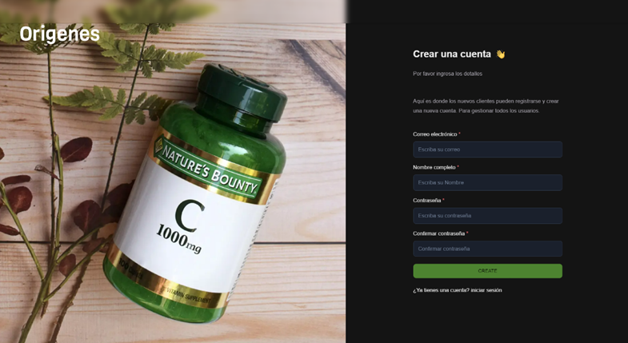
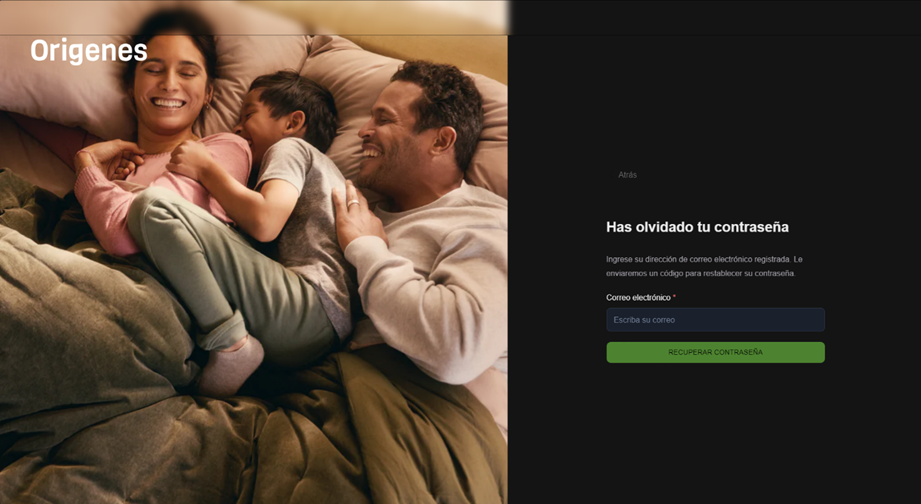
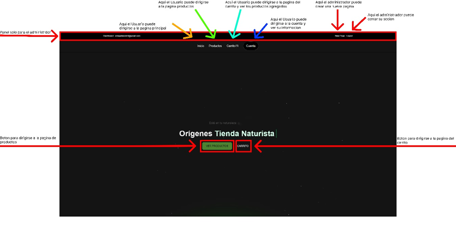
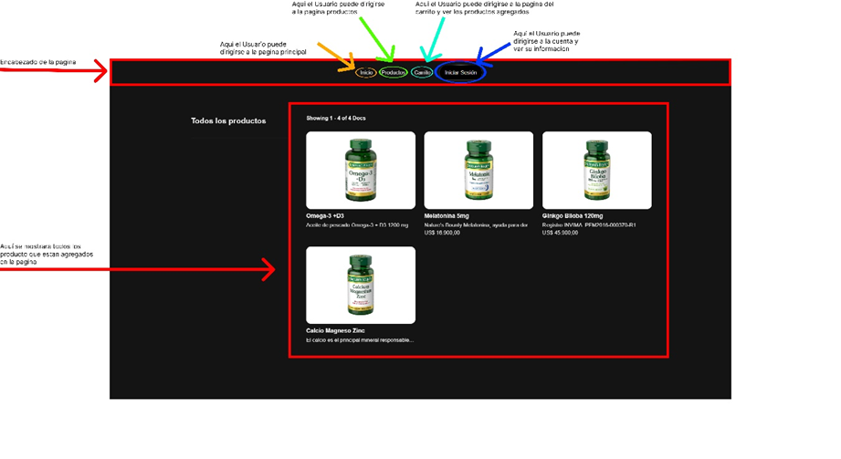
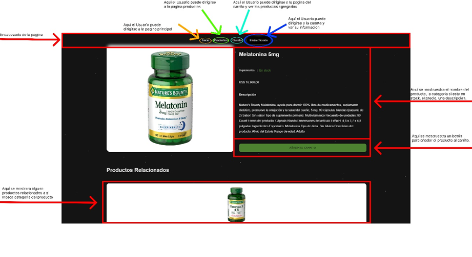
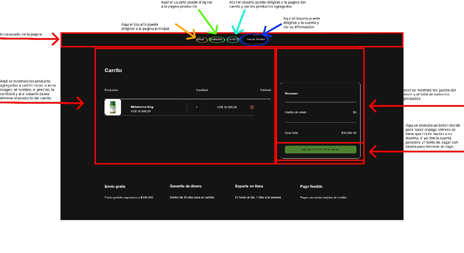
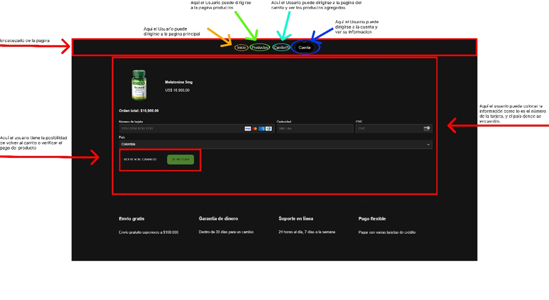
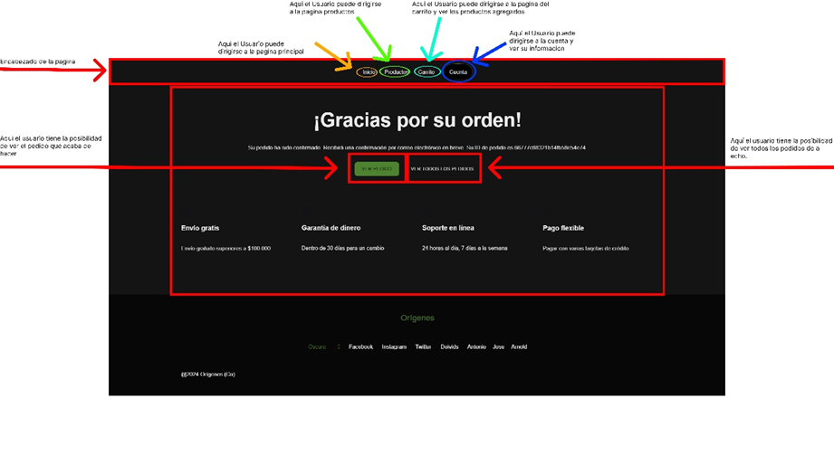
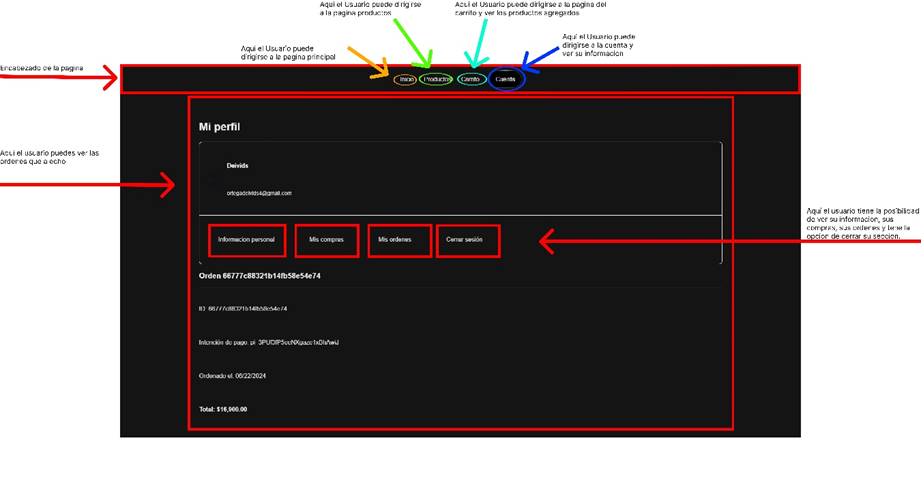

# **MANUAL DE USUARIO PAGINA WEB ORÍGENES**

Pagina web para la venta sus productos y servicios a través de internet.

Elaborado Por: Deivids Ortega

Versión: 1.0

#

# **Contenido**

[**MANUAL DE USUARIO PAGINA WEB ORÍGENES**  1](#_toc169985783)

[**Introducción**  3](#_toc169985784)

[**Inicio de Sesión**  4](#_toc169985785)

[**Crear cuenta**  5](#_toc169985786)

[**Recuperar contraseña**  6](#_toc169985787)

[**Esquema de Navegabilidad**  7](#_toc169985788)

# **Introducción**

**Bienvenido a la tienda online de Orígenes!**

Orígenes, su tienda naturista de confianza, ahora ofrece la comodidad de comprar sus productos y servicios favoritos
desde la comodidad de su hogar a través de nuestro nuevo software ecommerce. Disfrute de una experiencia de compra
fácil, segura y agradable mientras explora nuestra amplia gama de productos naturales para su salud y bienestar.

**¿Qué ofrece el software ecommerce de Orígenes?**

- **Navegación sencilla:** Encuentre fácilmente los productos que busca utilizando nuestras categorías intuitivas,
  filtros de búsqueda y barra de búsqueda.
- **Información detallada de productos:** Acceda a descripciones completas, imágenes y especificaciones de cada producto
  para tomar decisiones informadas.
- **Carrito de compras seguro:** Agregue sus productos favoritos al carrito de compras y revise su pedido antes de
  finalizar la compra de forma segura.
- **Variedad de métodos de pago:** Elija entre diferentes opciones de pago convenientes para completar su compra.
- **Seguimiento de pedidos:** Reciba notificaciones sobre el estado de su pedido y realice un seguimiento de su entrega
  hasta su llegada.
- **Cuenta personal:** Cree una cuenta para guardar su información de envío, historial de pedidos y acceder a ofertas
  exclusivas.

**¿Cómo empezar a comprar?**

1. **Navegue por las categorías:** Explore nuestras categorías de productos para encontrar lo que busca, como
   suplementos, alimentos orgánicos, productos de belleza natural y más.
1. **Agregue productos al carrito:** Una vez que encuentre un producto que le guste, haga clic en el botón "Añadir al
   carrito" para agregarlo a su carrito de compras virtual.
1. **Revise su carrito:** Acceda a su carrito de compras para revisar los productos seleccionados, verificar los
   precios.
1. **Proceda al pago:** Haga clic en el botón "Proceder al pago" para iniciar el proceso de pago seguro. Ingrese su
   información de envío, seleccione un método de pago y confirme su pedido.
1. **Finalice su compra:** Revise los detalles de su pedido, acepte los términos y condiciones y haga clic en el botón "
   Verificar" para finalizar su compra.

# **Inicio de Sesión**

**Propósito**

El propósito de una pantalla de inicio de sesión es permitir que los usuarios autorizados accedan a un área segura de un
sitio web. La pantalla de inicio de sesión generalmente muestra un formulario donde los usuarios pueden ingresar su
nombre de usuario y contraseña. Una vez que el usuario ha ingresado sus credenciales, puede hacer clic en un botón "
Iniciar sesión" o "Ingresar" para enviar el formulario. Si las credenciales son correctas, se le otorgará al usuario
acceso al área segura. Si las credenciales son incorrectas, se notificará al usuario y se le dará la oportunidad de
volver a intentarlo.

Componentes

Los siguientes son los componentes típicos de una pantalla de inicio de sesión:

- **Campo de nombre de usuario:**Un cuadro de texto donde el usuario puede ingresar su nombre de usuario.
- **Campo de contraseña:**Un cuadro de texto donde el usuario puede ingresar su contraseña. El campo de contraseña suele
  estar enmascarado para proteger la privacidad del usuario.
- **Botón de inicio de sesión:**Un botón en el que el usuario puede hacer clic para enviar el formulario de inicio de
  sesión.
- **Enlace de contraseña olvidada:**Un enlace en el que el usuario puede hacer clic si ha olvidado su contraseña. Este
  enlace generalmente conduce a una página donde el usuario puede ingresar su dirección de correo electrónico o nombre
  de usuario y solicitar un restablecimiento de contraseña.
- **Enlace para crear cuenta:**Un enlace en el que el usuario puede hacer clic si aún no tiene una cuenta. Este enlace
  generalmente conduce a una página donde el usuario puede crear una nueva cuenta.

# **Crear cuenta**

**Propósito**

El propósito de una pantalla de registro es permitir que nuevos usuarios creen una cuenta en un sitio web o aplicación.
La pantalla de registro generalmente muestra un formulario donde los usuarios pueden ingresar su información personal,
como nombre, dirección de correo electrónico y contraseña. Una vez que el usuario ha ingresado su información, puede
hacer clic en un botón "Registrarse" o "Crear cuenta" para enviar el formulario. Si la información es válida, se creará
una nueva cuenta para el usuario y se le notificará. El usuario podrá entonces iniciar sesión en su cuenta utilizando su
nombre de usuario y contraseña.

**Componentes**

Los siguientes son los componentes típicos de una pantalla de registro:

- **Campo de dirección de correo electrónico:**Un cuadro de texto donde el usuario puede ingresar su dirección de correo
  electrónico. La dirección de correo electrónico se utilizará como nombre de usuario del usuario.
- **Campo de nombre:**Un cuadro de texto donde el usuario puede ingresar su nombre.
- **Campo de contraseña:**Un cuadro de texto donde el usuario puede ingresar su contraseña. La contraseña debe ser
  segura y difícil de adivinar.
- **Campo de confirmación de contraseña:**Un cuadro de texto donde el usuario puede ingresar su contraseña nuevamente.
  Esto ayuda a garantizar que el usuario haya ingresado la contraseña correctamente.
- **Botón de registro:**Un botón en el que el usuario puede hacer clic para enviar el formulario de registro.
- **Enlace de inicio de sección:**Un enlace que el usuario puede hacer clic para dirigirlo al inicio de sección.

# **Recuperar contraseña**

**Propósito**

El propósito de una pantalla de recuperación de contraseña es permitir que los usuarios restablezcan su contraseña si la
han olvidado. La pantalla de recuperación de contraseña generalmente muestra un formulario donde los usuarios pueden
ingresar su nombre de usuario o dirección de correo electrónico. Una vez que el usuario ha ingresado su información,
puede hacer clic en un botón "Recuperar contraseña" o "Enviar enlace de restablecimiento" para enviar el formulario. Si
la información es válida, se enviará un correo electrónico al usuario con instrucciones sobre cómo restablecer su
contraseña. El usuario podrá entonces hacer clic en un enlace en el correo electrónico para establecer una nueva
contraseña.

Componentes

Los siguientes son los componentes típicos de una pantalla de recuperación de contraseña:

- **Campo de dirección de correo electrónico:**Un cuadro de texto donde el usuario puede ingresar su nombre de usuario o
  dirección de correo electrónico. Esta información se utilizará para identificar al usuario y enviarle instrucciones
  sobre cómo restablecer su contraseña.
- **Botón de recuperación de contraseña:**Un botón en el que el usuario puede hacer clic para enviar el formulario de
  recuperación de contraseña.

# **Esquema de Navegabilidad**

**Disfrute de su experiencia de compra en Orígenes**

Le invitamos a explorar nuestra tienda online y descubrir la amplia gama de productos naturales que Orígenes tiene para
ofrecerle. Si tiene alguna pregunta o necesita ayuda, no dude en contactarnos a través de nuestro correo electrónico.

**Descripción ampliada de la imagen para un manual de usuario**

**Encabezado**

El encabezado de la página web se encuentra en la parte superior de la pantalla y ocupa todo el ancho de la misma.
Contiene los siguientes elementos:

- **Menú de navegación:** Ubicado en la esquina superior derecha del encabezado, el menú de navegación facilita la
  exploración de las diferentes secciones del sitio web. Se compone de una lista de enlaces organizados en categorías
  como "Productos", "Carrito" y "Cuenta", si no tiene cuanta se mostrará un texto de inicio de sesión en cambio del
  texto de “Cuenta”.

**Área de contenido principal**

El área de contenido principal ocupa la mayor parte de la pantalla y se divide en tres columnas:

- **Botón en la parte izquierda:** Este botón muestra los productos. Este botón dirige a una página que muestra todos
  los productos pertenecientes a todas las categorías.
- **Botón en la parte derecha:** Este botón muestra el carrito. Este botón dirige a una página que muestra todos el
  carrito y los productos agregados allí.

  **Pie de página**

  El pie de página se encuentra en la parte inferior de la pantalla y ocupa todo el ancho de la misma. Contiene los
  siguientes elementos:

- **Información de derechos de autor:** Ubicada en la esquina izquierda del pie de página, indica que el contenido del
  sitio web pertenece a "Origen Tienda Naturista" y está protegido por derechos de autor del año 2024.
- **Enlaces a redes sociales:** Ubicados en la esquina derecha del pie de página, permiten a los usuarios acceder a las
  páginas oficiales de la tienda en redes sociales como Facebook, Instagram y Twitter, También se encontrará los nombres
  de los creadores del e-commerce.

**Descripción ampliada de la imagen para un manual de usuario**

**Encabezado**

El encabezado de la página web se encuentra en la parte superior de la pantalla y ocupa todo el ancho de la misma.
Contiene los siguientes elementos:

- **Menú de navegación:** Ubicado en la esquina superior derecha del encabezado, el menú de navegación facilita la
  exploración de las diferentes secciones del sitio web. Se compone de una lista de enlaces organizados en categorías
  como "Productos", "Carrito" y "Cuenta", si no tiene cuanta se mostrará un texto de inicio de sesión en cambio del
  texto de “Cuenta”.

**Área de contenido principal**

El área de contenido principal ocupa la mayor parte de la pantalla y se divide en tres columnas:

- **Columna derecha**: Esta columna contiene todos los productos de la página web el usuario puedes es coger el producto
  que desea o el de estaba buscando.

**Descripción ampliada de la imagen para un manual de usuario**

**Encabezado**

El encabezado de la página web se encuentra en la parte superior de la pantalla y ocupa todo el ancho de la misma.
Contiene los siguientes elementos:

- **Menú de navegación:** Ubicado en la esquina superior derecha del encabezado, el menú de navegación facilita la
  exploración de las diferentes secciones del sitio web. Se compone de una lista de enlaces organizados en categorías
  como "Productos", "Carrito" y "Cuenta", si no tiene cuanta se mostrará un texto de inicio de sesión en cambio del
  texto de “Cuenta”.

**Área de contenido principal**

El área de contenido principal ocupa la mayor parte de la pantalla y se divide en tres columnas:

- **Columna derecha**: Esta columna contiene todos los principales del producto como el nombre del producto, la
  categoría, si se encuentra en stock, el precio del producto y la descripción del producto.

**Descripción ampliada de la imagen para un manual de usuario**

**Encabezado**

El encabezado de la página web se encuentra en la parte superior de la pantalla y ocupa todo el ancho de la misma.
Contiene los siguientes elementos:

- **Menú de navegación:** Ubicado en la esquina superior derecha del encabezado, el menú de navegación facilita la
  exploración de las diferentes secciones del sitio web. Se compone de una lista de enlaces organizados en categorías
  como "Productos", "Carrito" y "Cuenta", si no tiene cuanta se mostrará un texto de inicio de sesión en cambio del
  texto de “Cuenta”.

**Área de contenido principal**

El área de contenido principal ocupa la mayor parte de la pantalla y se divide en tres columnas:

- **Columna Izquierda**: Esta columna contiene todos los productos agregados al carrito esta sesión tendrá como la
  imagen, el nombre, el precio, la cantidad y si el usuario desea eliminar el producto del carrito.

- **Columna derecha**: Esta columna contiene todos los principales Aquí se mostrará los gastos del envío y el total de
  todos los productos agregados, también está el botón para continuar con el pago con tarjeta del producto.

**Descripción ampliada de la imagen para un manual de usuario**

**Encabezado**

El encabezado de la página web se encuentra en la parte superior de la pantalla y ocupa todo el ancho de la misma.
Contiene los siguientes elementos:

- **Menú de navegación:** Ubicado en la esquina superior derecha del encabezado, el menú de navegación facilita la
  exploración de las diferentes secciones del sitio web. Se compone de una lista de enlaces organizados en categorías
  como "Productos", "Carrito" y "Cuenta", si no tiene cuanta se mostrará un texto de inicio de sesión en cambio del
  texto de “Cuenta”.

**Área de contenido principal**

El área de contenido principal ocupa la mayor parte de la pantalla y se divide en tres columnas:

- **Columna central**: Esta columna contiene la información de la tarjeta del usuario como el nuero de la tarjeta y el
  país donde se encuentra, en la parte inferior se puedes apreciar 2 botones una para volver la página del carrito y
  otro para verificar el pago.

**Descripción ampliada de la imagen para un manual de usuario**

**Encabezado**

El encabezado de la página web se encuentra en la parte superior de la pantalla y ocupa todo el ancho de la misma.
Contiene los siguientes elementos:

- **Menú de navegación:** Ubicado en la esquina superior derecha del encabezado, el menú de navegación facilita la
  exploración de las diferentes secciones del sitio web. Se compone de una lista de enlaces organizados en categorías
  como "Productos", "Carrito" y "Cuenta", si no tiene cuanta se mostrará un texto de inicio de sesión en cambio del
  texto de “Cuenta”.

**Área de contenido principal**

El área de contenido principal ocupa la mayor parte de la pantalla y se divide en tres columnas:

- **Botón en la parte Izquierda**: Este botón tiene la funcionalidad de poder dirigirte a una página donde puedes ver el
  usuario sus órdenes.

- **Botón en la parte derecha**: Este botón tiene la funcionalidad de poder dirigirte a una página donde puedes ver el
  usuario todas sus órdenes que a echo.

**Descripción ampliada de la imagen para un manual de usuario**

**Encabezado**

El encabezado de la página web se encuentra en la parte superior de la pantalla y ocupa todo el ancho de la misma.
Contiene los siguientes elementos:

- **Menú de navegación:** Ubicado en la esquina superior derecha del encabezado, el menú de navegación facilita la
  exploración de las diferentes secciones del sitio web. Se compone de una lista de enlaces organizados en categorías
  como "Productos", "Carrito" y "Cuenta", si no tiene cuanta se mostrará un texto de inicio de sesión en cambio del
  texto de “Cuenta”.

**Área de contenido principal**

El área de contenido principal ocupa la mayor parte de la pantalla y se divide en tres columnas:

- **Sesión central**: Esta parte se puedes ver la información del usuario como las ordenes, las compras, información
  personal y la opción de cerrar su sección, en la parte inferior se puede apreciar el id del producto y el di de la
  orden, la información del pago la fecha de la orden y el total que se verifico del pago.

